# Sapienza Beamer template

A LaTeX Beamer theme for slides in the style of Sapienza University of Rome, with a **light** and a **dark** variant.

> Unofficial. Not affiliated with or endorsed by Sapienza University of Rome.

| Light | Dark |
|---|---|
| 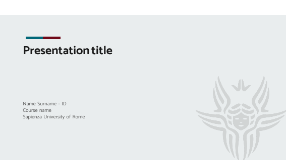 | 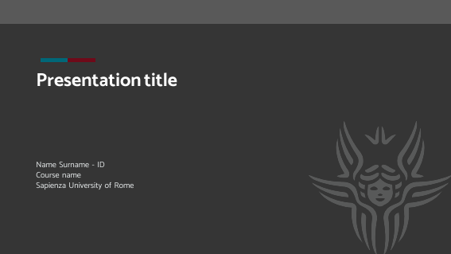 |
| 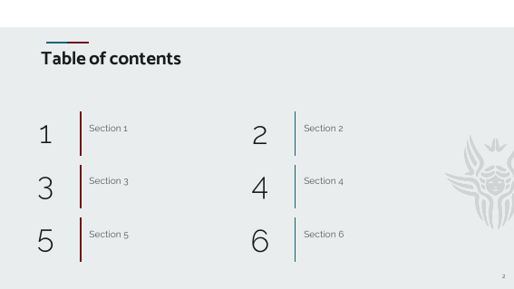 | 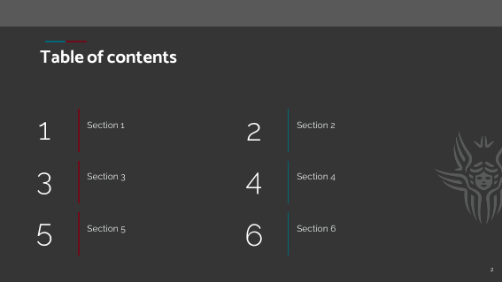 |
| 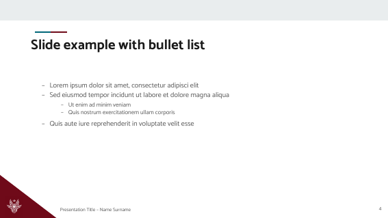 | 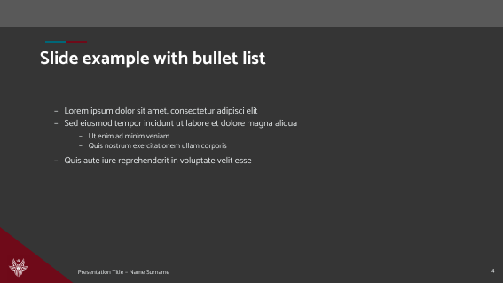 |
| 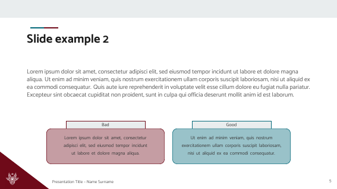 | 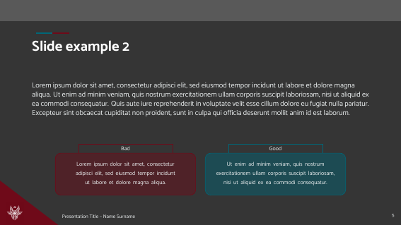 |
| 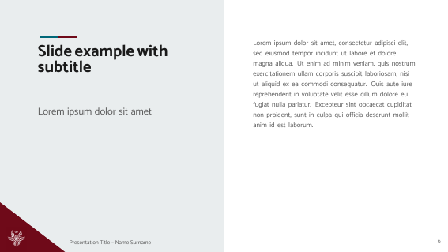 | 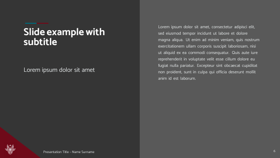 |
| 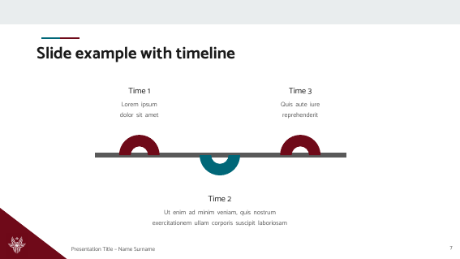 | 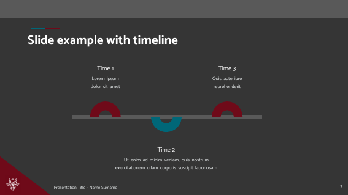 |
| 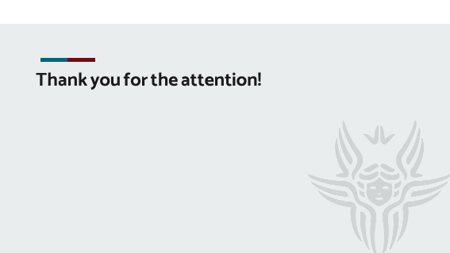 | 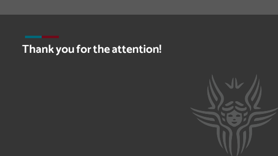 |

The documentation deck is available as [example_light.pdf](example_light.pdf).

## Credits

This theme is a Beamer port of the **Sapienza PPT template** created by
**Pietro Nardelli**:
<https://github.com/pietro-nardelli/sapienza-ppt-template>.
The design (layouts, colours, proportions, logo and slide structure) comes from his work; this repository
only translates it to LaTeX. The template was inspired by the Sapienza NLP Group.

If you use or redistribute this theme, please keep this attribution.

## Quick start

Requires XeLaTeX (or LuaLaTeX) and `latexmk`.

```sh
make          # main deck and documentation deck, light and dark
make light    # only the light variant of the main deck
make dark     # only the dark variant of the main deck
make example  # only the documentation deck (both variants)
make clean
```

To use the theme in your own deck, copy `beamerthemeSapienza.sty`, `fonts/` and `img/` next to your `.tex` and write:

```latex
\documentclass[t,aspectratio=169]{beamer}
\usetheme[light]{Sapienza}   % or [dark]

\title[Short title]{Long title}
\author[Short name]{Full name}
\subtitle{Course name}
\institute{Sapienza University of Rome}

\begin{document}
\begin{frame}[plain]\titlepage\end{frame}
\begin{frame}{A slide}
  \begin{itemize}
    \item Hello
  \end{itemize}
\end{frame}
\end{document}
```

The footer shows the short title and short author, so pass the short forms as the optional arguments.
Compile twice (`latexmk` does it for you): the overlays use `remember picture`.

## Overleaf

The theme uses `fontspec`, which needs XeLaTeX or LuaLaTeX. Overleaf runs `latexmk -pdf`, which would start
pdfLaTeX and stop with `Fatal Package fontspec Error`. The `latexmkrc` in this project fixes it by making the
`pdflatex` command run XeLaTeX, so the project compiles with the default settings:

```perl
$pdf_mode = 5;
$pdflatex = "xelatex -interaction=nonstopmode -synctex=1 %O %S";
$xelatex  = "xelatex -interaction=nonstopmode -synctex=1 %O %S";
```

Upload the project (or open the template), keep `latexmkrc` in the root, and compile `main.tex`.
If you copy the theme into another project, copy `latexmkrc` too, or set Menu → Compiler → XeLaTeX.
After changing it, use "Recompile from scratch".

## What is in the repository

| File | Content |
|---|---|
| `beamerthemeSapienza.sty` | The theme |
| `main.tex` | The example slides of the original template, ported one to one |
| `example.tex` | Documentation deck (28 slides): every feature explained in the slides, plus technical notes |
| `latexmkrc` | Makes Overleaf compile with XeLaTeX |
| `fonts/` | Catamaran and Raleway (SIL OFL) |
| `img/` | Sapienza logo, light and dark versions, extracted from the original PPTX |
| `docs/` | Screenshots used in this README |

## Commands

| Command | Use |
|---|---|
| `\begin{frame}[plain]\titlepage\end{frame}` | Title slide (`\title`, `\author`, `\subtitle`, `\institute`) |
| `\sapToc{Title}{Sec 1,Sec 2,...}` | Numbered two-column table of contents (inside a `[plain]` frame) |
| `\begin{frame}{Title}` | Content slide |
| `\sapSection{Title}{Subtitle}{Body}` | Split section slide (inside a `[plain]` frame) |
| `\sapCompare{}{y}{bad}{good}` | Bad / Good boxes, `y` = top edge in inches from the slide top |
| `\sapTimeline{T1}{d1}{T2}{d2}{T3}{d3}` | Three-point timeline |
| `\sapClosing{Thank you!}` | Closing slide (inside a `[plain]` frame) |
| `\sapAt[opts]{x}{y}{text}` | Text box at an absolute position (inches of the original 10 x 5.625 in slide) |

## Layout

All geometry comes from the original PPTX and is scaled with the page width (`\sapU` = 1 in of the original
slide), so the theme works with any `aspectratio=169` paper size.

## License

[CC BY-NC-SA 4.0](https://creativecommons.org/licenses/by-nc-sa/4.0/), the same license as the original template:
attribution, non-commercial use, share-alike. Fonts are under the SIL Open Font License (see `fonts/`).
